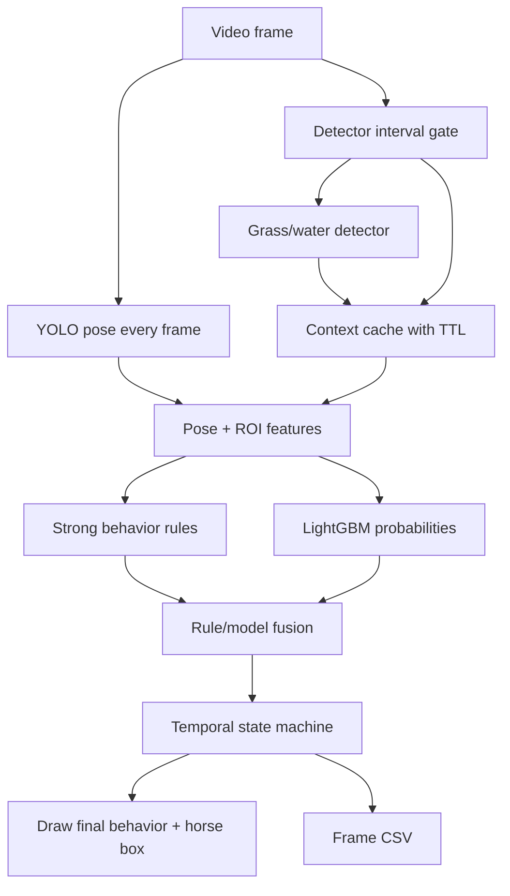

# Pose Hybrid Behavior Design

日期：2026-05-27  
项目：`D:\DevWorkSpace\python\HorseBehavior`

## 目标

基于当前正式 YOLO pose 模型：

```text
runs/pose/horse_pose_yolo_core6_crop/weights/best.pt
```

实现实时行为识别入口：

```text
infer.py --method pose-hybrid
```

第一版采用“规则强信号 + LightGBM 分类 + 时序状态机”的混合方案。实时策略是：

1. YOLO pose 每帧运行。
2. 草料/水桶检测每 5-10 帧运行一次。
3. 检测间隔内复用最近一次草/水检测结果，并使用 TTL 过期。
4. LightGBM 和状态机每帧运行。
5. 非 debug 模式只绘制最终行为和马框。

## 行为类别

第一版输出以下行为：

```text
standing
eating
drinking
head_down
lying
unknown
```

`sitting` 暂不作为 pose-hybrid 第一版核心输出。当前 6 点姿态没有腿部关键点，仅靠 `nose / jaw / withers / neck_end / mid_back / croup` 难以稳定判断坐下。后续如果继续保留坐下类别，应融合旧检测器的 `sitting_horse` 框，或扩展姿态点集。

## 输入与输出

输入：

- 视频源路径。
- YOLO pose 权重。
- 草料/水桶检测器权重，可选。
- 固定 ROI 配置，例如 `config/feed_regions.yaml`，后续可扩展水桶 ROI。
- LightGBM 行为模型、标签编码器和特征列定义。

输出：

- 标注视频。
- 逐帧 CSV。
- 每帧最终行为、原始规则结果、LightGBM 概率、融合原因、状态机状态和耗时统计。

CSV 推荐列：

```text
frame,time_sec,behavior,stable_state,rule_behavior,rule_reason,rule_confidence,
model_behavior,model_confidence,fusion_source,fusion_reason,pose_confidence,
pose_ms,detector_ms,feature_ms,model_ms,state_ms,draw_ms,fps,keypoints,detections
```

## 数据流



## 模块设计

### `pose_feature_extractor.py`

职责：把 6 点 YOLO pose、马框、草/水检测框和固定 ROI 转成结构化特征。

关键输入：

- `PoseInstance`
- `ContextDetections`
- feed/water ROI
- 当前帧时间和上一帧缓存

核心特征：

```text
nose_visible
jaw_visible
backline_visible
nose_box_y_ratio
nose_backline_y_diff
nose_to_feed_distance
nose_to_water_distance
nose_in_feed_region
nose_in_water_region
head_vector_angle
backline_angle
backline_flatness
horse_box_aspect_ratio
nose_speed
neck_end_speed
recent_pose_missing_count
keypoint_conf_mean
```

### `pose_behavior_rules.py`

职责：只输出高确定性或可解释规则信号，不承担全部分类。

推荐规则：

```text
lying:
  backline_flatness 很低，horse box 高宽比偏低，且持续满足。

drinking:
  nose 低于背线，且靠近 water box 或 water ROI。

eating:
  nose 低于背线，且靠近 grass box 或 feed ROI。

head_down:
  nose 明显低于背线，但不靠近草/水。
```

规则输出：

```text
RuleSignal(
    behavior,
    reason,
    confidence,
    strength
)
```

`strength` 分为：

```text
strong: lying, drinking, eating
medium: head_down
weak: standing/default
```

### `train_pose_lightgbm.py`

职责：基于导出的逐帧特征和人工行为标签训练 LightGBM。

第一版训练数据可以来自：

- 已有视频抽帧标签。
- 现有 ROI/LightGBM 行为标签数据。
- 人工修正后的 pose-hybrid CSV。

输出：

```text
runs/behavior_pose_hybrid/lightgbm_pose_behavior.joblib
runs/behavior_pose_hybrid/label_encoder.joblib
runs/behavior_pose_hybrid/feature_columns.txt
```

训练时应保存特征列顺序，推理必须按同样顺序组装特征。

### `pose_behavior_fusion.py`

职责：融合规则信号和 LightGBM 概率。

裁决原则：

```text
1. strong 规则命中 lying/drinking/eating，且置信度达到阈值时优先规则。
2. 规则和 LightGBM 一致时，提高最终置信度。
3. LightGBM 置信度很高，规则只是 medium/weak 时，采纳 LightGBM。
4. standing 不应立即覆盖稳定的 eating/drinking/lying。
5. unknown 只在 pose 缺失、模型低置信、规则无信号时输出。
```

融合输出：

```text
FusedBehaviorDecision(
    behavior,
    confidence,
    source,
    reason,
    rule_behavior,
    model_behavior
)
```

### `pose_behavior_state_machine.py`

职责：让最终行为按时间稳定切换，而不是逐帧跳动。

默认 25 FPS 参数：

```text
eating/drinking:
  enter_frames = 6
  exit_frames = 12

head_down:
  enter_frames = 4
  exit_frames = 8

lying:
  enter_frames = 8
  exit_frames = 20

standing:
  enter_frames = 8
```

状态机输出：

```text
stable_behavior
pending_behavior
state_age_frames
transition_reason
```

### `infer_behavior_pose_hybrid.py`

职责：完整推理入口。

默认参数建议：

```text
--pose-model runs/pose/horse_pose_yolo_core6_crop/weights/best.pt
--det-interval 8
--det-ttl 25
--pose-imgsz 640
--det-imgsz 640
--smooth-fps 25
--debug false
```

检测器策略：

1. 当前帧编号能被 `det_interval` 整除时运行草/水检测器。
2. 其他帧复用缓存检测结果。
3. 缓存超过 `det_ttl` 帧未更新则丢弃。
4. 第一版不引入复杂 tracker；固定摄像头场景下先使用缓存和 TTL。
5. 如果后续发现草/水框抖动明显，再加入 IoU 匹配和滑动平均。

## 实时性能目标

目标是在 RTX 4050 Laptop GPU 上接近或达到常见马厩视频实时速度。

主要耗时来自：

```text
YOLO pose 每帧推理
草/水检测器隔帧推理
视频解码、绘制、编码
```

规则、LightGBM 和状态机的耗时应接近可忽略。

第一版必须记录分段耗时：

```text
pose_ms
detector_ms
feature_ms
model_ms
state_ms
draw_ms
fps
```

如果性能不足，优化顺序：

1. 增大 `det_interval`。
2. 降低 `pose-imgsz` 或 `det-imgsz`。
3. 非 debug 模式减少绘制内容。
4. 对检测器使用固定 ROI 替代每次检测。
5. 后续再考虑 TensorRT 或 ONNX。

## 错误处理

- pose 模型不存在：启动时返回错误。
- LightGBM 模型不存在：第一版可以允许 `--rules-only` 跑规则和状态机；默认完整模式应报错。
- 检测器不存在：如果提供固定 ROI，则允许无检测器运行；否则继续运行但草/水相关规则降级。
- 某帧无 pose：输出 `unknown` 或保持上一稳定状态，CSV 记录 `no_pose`。
- 草/水缓存过期：上下文框为空，吃饭/喝水规则不触发。
- 特征列缺失：推理启动时校验并报错，避免 LightGBM 输入错位。

## 测试计划

单元测试：

- 6 点 keypoint 到特征的转换。
- nose 相对背线高度计算。
- 草/水检测缓存 TTL。
- 规则强信号输出。
- LightGBM 特征列顺序校验。
- 规则与模型融合冲突裁决。
- 状态机进入/退出行为。
- `infer.py --method pose-hybrid` 分发。

集成测试：

- 使用 fake YOLO pose result 跑 3-5 帧，验证 CSV 行和状态机输出。
- 使用短视频或少量帧 smoke test，验证不显示窗口时能输出视频和 CSV。
- debug 模式绘制关键点、草/水框和原因；非 debug 模式只画最终行为和马框。

## 第一版不做的内容

- 不训练视频深度模型。
- 不引入复杂多目标 tracker。
- 不把 `sitting` 作为 6 点姿态的强判断目标。
- 不默认绘制完整骨架和所有调试文字。
- 不把 DLC/SuperAnimal 放入实时推理链路。

## 验收标准

第一版完成后应满足：

1. `infer.py --method pose-hybrid` 可以处理短视频。
2. 非 debug 输出视频只显示马框和最终行为。
3. CSV 包含每帧行为、规则、模型、融合、状态机和耗时信息。
4. 草/水检测按 `det_interval` 隔帧运行，间隔内使用缓存。
5. 在没有草/水检测器但有固定 ROI 时仍可运行。
6. 单元测试覆盖核心特征、规则、融合、状态机和入口分发。
